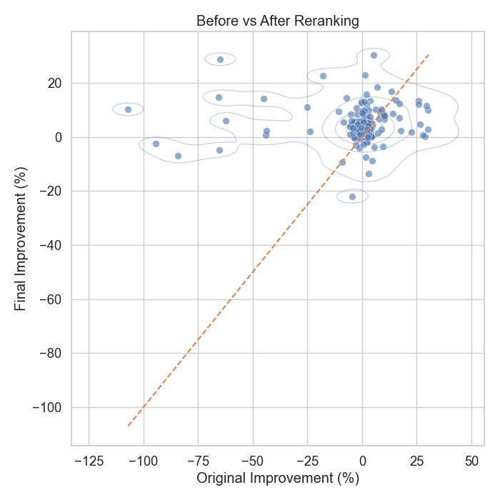

# Sequential Rule Scheduling for Query Rewrite

### contributor: Ming Xu

This repository uses a two-stage workflow:
- **Stage 1**: an LLM selects candidate rewrite rules for each query.
- **Stage 2**: runs `llm_sequence` evaluation and `greedy-backward` reranking/evaluation.

## Results

<p align="center">
  
</p>

Overall, our method improves query performance for 64.29% of queries, while 35.71% experience some degradation. Notably, although some LLM-generated rewrites initially perform worse than the original query, our execution-guided refinement is able to further optimize these cases and recover performance gains. In addition, our approach preserves high correctness, achieving an equivalence accuracy of 92.86%.

---

## 1) Environment setup

Use either setup method below.

### Option A: `requirements.txt` (venv + pip)

```bash
python -m venv .venv
source .venv/bin/activate  # Windows: .venv\Scripts\activate
pip install -r requirements.txt
```

### Option B: `environment.yml` (conda)

```bash
conda env create -f environment.yml
conda activate query-rewrite
```

### Build the Java rewriter jar

Run the following commands from the project root:

```bash
rm -rf build

mkdir -p build/classes
find src rule_library/java -name "*.java" > build/java_sources.txt
javac -cp "rule_library/calcite_core_main_jar/*" -d build/classes @build/java_sources.txt

mkdir -p build/fat
cp -r build/classes/* build/fat/

for j in rule_library/calcite_core_main_jar/*.jar; do
  (cd build/fat && jar xf "../../$j")
done

find build/fat/META-INF -type f \( -name "*.SF" -o -name "*.DSA" -o -name "*.RSA" \) -delete

printf "Main-Class: ruleexec.SingleRuleRewriterMain\n" > build/manifest.mf
jar cfm build/single_rule_rewriter.jar build/manifest.mf -C build/fat .
```


## 2) Input CSV requirements (Stage 1)

Recommended input location:

```bash
data/queries/stage1_input.csv
```

Minimum required columns:

```csv
query_id,original_sql
1,SELECT * FROM t WHERE a > 1
2,SELECT c FROM t2 WHERE c IS NOT NULL
```

Run Stage 1:

```bash
python -m scripts.run_stage1 \
  --input-csv data/queries/stage1_input.csv \
  --max-rules 5 \
  --include-empty \
  --save-csv \
  --llm-model @azure-1/gpt-4o \
  --prompt-version v1 \
  --api-base-url https://genai.vocareum.com/v1 \
  --output-dir outputs/stage1 \
  --rule-library rule_library/standard.txt
```

Optional (online mode key):

```bash
export VOC_API_KEY="<your_api_key>"
```

---

## 3) Stage 1 outputs

Recommended output directory: `outputs/stage1`

- Per-query JSON: `outputs/stage1/json/<query_id>.json`
- Consolidated CSV: `outputs/stage1/stage1_results.csv`

---

## 4) Stage 2 input + run commands

Stage 2 can read from either source:

- `stage1` (default): `outputs/stage1/stage1_results.csv`
- `baseline`: `baseline/stage1_results.csv`

You can always override both with:

- `--stage1-csv <path>` (highest priority)

### Accepted rule columns when loading Stage 2 input

Stage 2 accepts either of these columns for rule candidates:
- `candidate_rules` (Stage 1 format)
- `rule_set` / `ruleset` (baseline-compatible fallback)

`candidate_rules`/`rule_set` can be:
- JSON list (recommended), e.g. `["RULE_A", "RULE_B"]`
- delimiter-separated text, e.g. `RULE_A,RULE_B`

### Run `llm_sequence`

From Stage 1 output (default):

```bash
python -m scripts.run_stage2_llm_sequence \
  --input-source stage1 \
  --output-csv outputs/stage2/llm_sequence.csv \
  --benchmark tpch
```

From baseline CSV:

```bash
python -m scripts.run_stage2_llm_sequence \
  --input-source baseline \
  --baseline-csv baseline/stage1_results.csv \
  --output-csv outputs/stage2/llm_sequence.csv \
  --benchmark tpch
```

### Run `greedy-backward` (recommended for baseline comparison)

`greedy-backward` reads:
- baseline rewritten results from `--input-csv` (default: `baseline/baseline.csv`)
- candidate/recommended rule sets from `--stage1-csv` (default: `outputs/stage1/stage1_results.csv`)

```bash
python -m scripts.run_stage2_greedy_backward \
  --input-csv baseline/baseline.csv \
  --stage1-csv outputs/stage1/stage1_results.csv \
  --output-csv outputs/stage2/greedy_backward.csv \
  --benchmark tpch \
  --rewrite-jar-path build/single_rule_rewriter.jar
```

If Stage 1 was generated from baseline rule sets, replace `--stage1-csv` with your baseline-compatible Stage 1 CSV path.

### Baseline comparison note

LLM rule selection is stochastic. Running baseline and this project independently may produce different rule sets.
For a fair comparison, place baseline output under `baseline/` and run Stage 2 with baseline-compatible inputs (`--input-source baseline` for `llm_sequence`, and matching `--input-csv` + `--stage1-csv` for `greedy-backward`) so both pipelines use the same rule set.

---

## 5) Stage 2 outputs

Recommended output directory: `outputs/stage2`

- `outputs/stage2/llm_sequence.csv`
- `outputs/stage2/greedy_backward.csv`

---

## Appendix: common Stage 2 options

```bash
python -m scripts.run_stage2_llm_sequence --help
python -m scripts.run_stage2_greedy_backward --help
```

Common options:
- `--benchmark {tpch,tpchj}` (default: `tpch`)
- `--rewrite-jar-path`
- `--runs`
- `--warmup-runs`

## Code Structure

The codebase is organized into two main parts: (1) final system execution pipeline and (2) experimental components.

### 1) Final System (Execution Pipeline)

scripts/
- run_stage1.py: entry point for Stage 1 LLM-based rule selection
- run_stage2_greedy_backward.py: main entry point for Stage 2 optimization using greedy-backward reranking
- run_stage2_llm_sequence.py: directly reads the input CSV, sequentially applies the selected rewrite rules, executes the rewritten SQL, and outputs latency and equivalence results

rule_library/
- standard.txt: rewrite rule definitions
- java/: Java implementation for rule execution and rule checking
- calcite_core_main_jar/: third-party Apache Calcite libraries used for SQL parsing and rewriting

### 2) Experimental Components

src/stage2/
- evaluator.py: evaluates query latency and equivalence
- runner.py: earlier Stage 2 pipeline abstraction used for policy-based execution
- policies.py: implementations of different rule scheduling strategies, including:
  - llm_sequence: applies rules in LLM-recommended order
  - greedy: iterative rule selection based on local improvements
  - lookahead (experimental): evaluates future rule sequences for better global decisions

scripts/
- run_stage2_llm_sequence.py (earlier version): policy-based execution using runner and policies
- other experimental scripts for testing different scheduling strategies

pools/
- positive and negative query pools used for rule selection experiments

baseline/
- baseline query rewrites and results for comparison

outputs/
- stores intermediate and final experimental results
